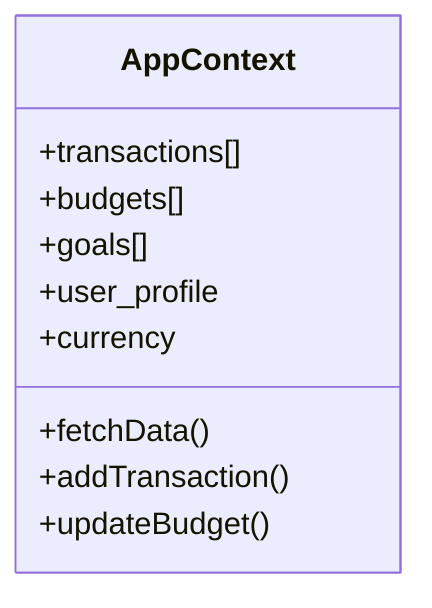

# ⚙️ Technical Implementation

SpendWise leverages state-of-the-art technologies to provide a high-performance personal finance experience.

## 🧠 Fiscal AI Intelligence
The core intelligence layer is powered by **Groq Cloud API** running **LLaMA 3.3 70B**.

### AI Workflow Pipeline:
1. **Data Harvesting**: Transactions and budgets are serialized into a minimal context payload.
2. **System Prompting**: Instructions define the "Personal CFO" persona, ensuring objective advice.
3. **Inference**: Groq's LPU™ technology enables sub-second responses even for complex queries.
4. **Context Injection**: The AI sees current balances to provide real-time budget optimization.

## ⚛️ Global State Management
Both Web and Mobile platforms utilize the **React Context API** for a unified data source.

### AppContext Model:

## 🔄 Real-time Synchronization
Synchronization is handled via **Firebase SDK Listeners**.
- Every write triggers a cloud event.
- Listeners on all active devices update the local state optimistically.
- Ensures a "Zero Refresh" experience across devices.

---
[🏠 Return to Wiki Portal](../WIKI.md)
