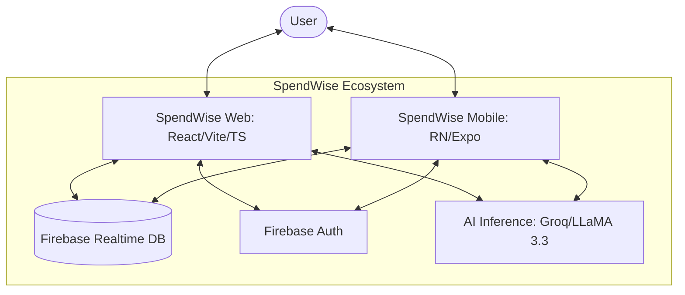

# 🏗️ System Design & Architecture

SpendWise is built on a **Context-Driven Reactivity (CDR)** pattern, ensuring that financial data flows seamlessly between the web and mobile instances through a centralized real-time cloud backbone.

## 🏛️ High-Level Architecture

## 🎨 Design Philosophy: Glassmorphism
The visual identity of SpendWise follows the **Glassmorphism** aesthetic, utilizing:
- **Translucency**: Backdrop filters at `blur(12px)`.
- **Contrast**: Deep obsidian backgrounds with neon accents.
- **Micro-interactions**: Subtle scale-transforms on hover and press.

## 🗃️ Data Modeling (Real-time DB)
SpendWise uses a normalized schema for instant reactivity:
- `/users/{uid}/settings`: Localized preferences (Currency, Theme).
- `/users/{uid}/transactions`: chronological log of fiscal events.
- `/users/{uid}/budgets`: Category-mapped spending limits.
- `/users/{uid}/goals`: Target-based savings trackers.

---
[🏠 Return to Wiki Portal](../WIKI.md)
